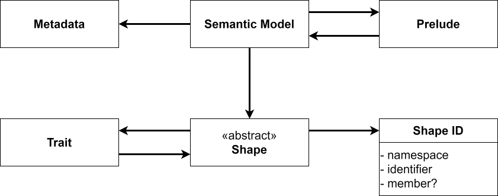

# The Subjekt Model

The Subjekt model describes the Subjekt's semantic model and the files used to create it. Subjekt models are used to describe data structures, smart contracts, services, and subjects.

## Subjekt Overview

The Subjekt model can be represented in various forms, including as a semantic model, through the Interface Definition Language (IDL), and as an Abstract Syntax Tree (AST) in JSON format.


#### Semantic model

The in-memory model used by tools. The semantic model may be serialized into one or more model file representations.

#### Model File

A file on the file system in a specific format. Model files can be divided across multiple files for better readability or modularity, and these files can use different formats (`.subjekt` or `.json`). It's the responsibility of the tooling to merge all necessary model files into a valid semantic model, as model files do not explicitly include one another.

#### Representation

A particular model file format such as `.subjekt` or `.json`. Representations are loaded into the semantic model by mapping the representation to the shape types in the semantic model.

- [**Subjekt IDL**](./idl): a human-readable format that aims to streamline authoring, reading, and sharing models.
- [**JSON AST**](./ast): a machine-readable JSON-based format.

## Semantic Model

The semantic model is an in-memory model used by tools. It is independent of any particular serialized representation. The semantic model contains the metadata and a graph of shapes connected by shape IDs.



- **Metadata**: [Metadata](#metadata) is a schema-less extensibility mechanism used to associate metadata to an entire model.
- **Prelude**: The [prelude](#prelude) defines various simple shapes and every trait defined in the core specification.
- **Shape**: [Shapes](#shapes) are named definitions that describe the data structures.
- **Shape ID**: A [Shape ID](#shape-id) is used to identify shapes defined in the model.
- **Trait**: [Traits](#traits) are applied to shapes to associate metadata to a shape.

## Metadata

Metadata is a schema-less extensibility mechanism used to associate metadata to an entire model. Metadata is defined using a node value. The following example configures a model validator:

```subjekt
metadata validators = [
    {
        name: "EmitEachSelector"
        id: "OperationInputName"
        message: "This shape is referenced as input but the name does not end with 'Input'"
        configuration: {
            selector: "operation -[input]-> :not([id|name$=Input i])"
        }
    }
]
```

When a conflict occurs between top-level metadata key-value pairs, the following conflict resolution logic is used:

1. If both values are arrays, the values of both arrays are concatenated into a single array.
2. Otherwise, if both values are exactly equal, the conflict is ignored.
3. Otherwise, the conflict is invalid.

## Node Values

Node values are JSON-like values used to define metadata and the value of an applied trait.

| Type | Description |
| ---- | ----------- |
| array | A list of heterogeneous node values |
| null | The lack of value |
| number |	A double precision floating point number |
| object | A map of string keys to heterogeneous node values |
| string | A UTF-8 string |

The following example defines a trait using a node value:

```subjekt
@length(min: 1, max: 10)
string MyString
```

## Shape ID

A shape ID is used to refer to shapes in the model. All shapes have an assigned shape ID. Shape IDs have the following syntax:

```
subjekt.example.foo#ExampleShapeName$memberName
└─────────┬──────┘ └───────┬──────┘ └────┬───┘
     (Namespace)   (Shape name)  (Member name)
                  └──────────────┬────────────┘
                         (Relative shape ID)
└──────────────────────┬───────────────────────┘
              (Absolute shape ID)
```

- **Absolute shape ID**: An absolute shape ID starts with a namespace, followed by "#", followed by a relative shape ID.
- **Relative shape ID**: A relative shape ID contains a shape name and an optional member name. The shape name and member name are separated by the "$" symbol if a member name is present.
- **Namespace**: A namespace is a mechanism for logically grouping shapes in a way that makes them reusable alongside other models without naming conflicts. A semantic model may contain shapes defined across different namespaces.
- **Shape name**: The name of the shape within a namespace. Model authors should utilize a strict form of PascalCase in which only the first letter of acronyms, abbreviations, and initialisms are capitalized. For example, prefer UserId over UserID, and Arn over ARN.

## Shapes

Shapes are named definitions of types. Shapes are visualized using the below diagram:

## Traits

## Prelude